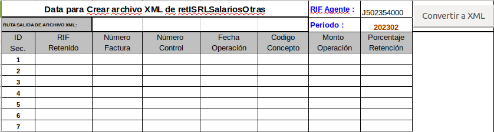

# eltxt

Interfaz web que genera el XML subido a SENIAT de ISLR por retenciones

## Introduccion

Toma un txt y genera el XML para retenciones, este es la interfaz original:

# Desarrollo

Para comenzar a desarrollar aun un manual minimo instructivo en [DESARROLLO.md](../DESARROLLO.md) 
donde se detallan las herramientas y el entorno para trabajar.

Se usa una base codeigniter lo que facilita la comprension MVC, que separa 
un directorio para cada vista y/o controlador.

# Instalacion

Se asume que ud usa el usuario `general` estandarizado VenenuX.

Instalar el sofware necesario

`apt-get install git lighttpd mysql-server php5-cgi php5-gd php5-mysql php5-mcryp php5-curl php5-odbc tdsodbc `

Crear directorio home

`mkdir -p /home/general/Devel;  cd /home/general/Devel`

Descargar el repositorio git

`git clone https://gitlab.com/codeigniterpower/codeigniter-xmlislr`

Iniciar el repositorio con las dependencias

`git submodule init ;git submodule update --rebase ;git submodule foreach ;git checkout master;`

Abrir el navegador internet y navegar hacia el login

`firefox-esr http://localhost/~general/`

Esto asume que su webserver tiene habilitado el modulo para "UserDir" 
esto es con `mod_userdir` en `apache2` o `userdir` in `lighttpd`, y debe 
esto a su vez soportar `php` junto con el `php-xml`, los pasos descritos 
emplean su home de usuario para servir los archivos.

