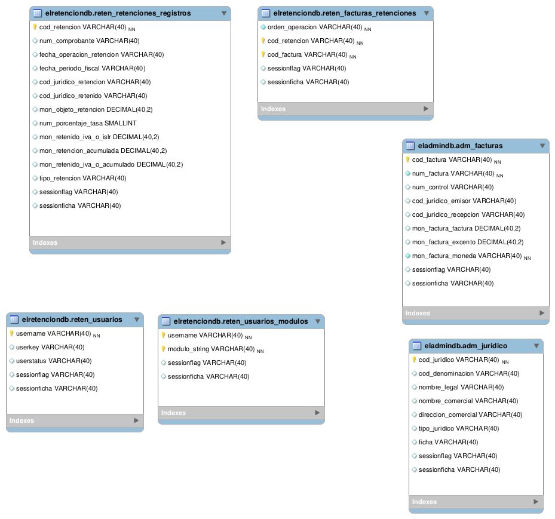

README base de datos "elretencion"
===========================

El proyecto usa varias bases de datos, pero se conecta a tres DBMS unicamente:

* MYSQL/MARIADB: se conecta a la `localhost` empleando las db `elretenciondb` y `elsistemadb`
* SAINT: se conecta a la `37.10.254.199` empleando las db `contabilidad` principalmente y otras.

El proyecto usa dos tipos de acceso, **ODBC** y **MySQL** en el php o en gambas.

En el directorio [elretenciondb](elretenciondb) esta el archivo `elretenciondb.sql` cargar 
esto en el servidor localhost de la maquina instalado en "localhost" y especificar o 
corregir la conexcion en el archivo `elretencionweb/config/database.php` del grupo correspondiente "elretenciondb".
En el mismo archivo esta ya el string DNS especificado de OASIS, certificar y corregir.

A continuacion se especifica cada uno de estos componentes.

### Configuracion MySQL

Se instala MariaDB o MySQL pero abierto a toda ip y con el puerto abierto a todos, 
adicional se configura para no usar DNS y con iptables se cierra a los hosts, 
**CUIDADO** se asume MariDB/MySQL  entre 5.0 y hasta 5.5 solamente.

```
sed -i -e 's/skip-external-locking/skip-external-locking\nlocal-infile=0/g' /etc/mysql/my.cnf
sed -i -e 's/skip-external-locking/skip-external-locking\nskip-name-resolve/g' /etc/mysql/my.cnf
sed -i 's/bind-address.*=.*/bind-address=0.0.0.0/g' /etc/mysql/my.cnf
iptables -I INPUT -p tcp -s 0.0.0.0/0 --dport 3306 -j DROP
iptables -I INPUT -p udp -s 0.0.0.0/0 --dport 3306 -j DROP
iptables -I INPUT -p tcp -s 127.0.0.1 --dport 3306 -j ACCEPT
iptables -I INPUT -p tcp -s localhost --dport 3306 -j ACCEPT
iptables -I INPUT -p tcp -s 37.10.254.199 --dport 3306 -j ACCEPT
iptables -I INPUT -p tcp -s 10.10.34.30 --dport 3306 -j ACCEPT
```

El iptables es sensible al orden, ordenes DROP se ejecutan/van primero que las ACCEPT, cuidado!
Se usa MariaDB, el usuario es `elretencion`, y no puede crear esquemas, por ende deben existir siempre, 
al recrear o trabajar en desarrollo, la clave esta definica en el passmanager o en el proyecto.

``` sql
CREATE USER 'elretencion'@'%' IDENTIFIED BY '***';
GRANT USAGE ON * . * TO 'elretencion'@'%' IDENTIFIED BY '***' WITH MAX_QUERIES_PER_HOUR 0 MAX_CONNECTIONS_PER_HOUR 0 MAX_UPDATES_PER_HOUR 0 MAX_USER_CONNECTIONS 0 ;
GRANT ALL PRIVILEGES ON `elretenciondb` . * TO 'elretencion'@'%';
```

Estas sentencias deben estar pre-ejecutadas como administrador en 
el sistema de base de datos MySQL/MariaDB:

``` sql
REVOKE ALL PRIVILEGES ON elretenciondb.* FROM 'sysdbuser'@'%';
GRANT ALL PRIVILEGES ON elretenciondb.* TO 'sysdbuser'@'%' WITH GRANT OPTION ;
```

### Configuracion y ODBC

Para configurar el acceso ODBC se requiere previa preparacion, 
leer [odbc-README.md](odbc-README.md) en donde se cubre los aspectos 
importantes para conectarse usando ODBC y DSN definidos.

### Base de datos Oasis

En la base de datos `OP_001037` se preparan tablas proxy de la db `elretenciondb` para portabilidad.
Las tablas proxy son conexciones directas desde Sybase hacia otras bases de datos, en donde 
se puede usar directamente tablas externas desde esa otra base de datos.
La configuracion de estas se cubre en [sybase-README.md](sybase-README.md#tablas-proxy)

### Diseño de la DB

El diseño de la db es solo, `elretencion` el **resto es tomado desde la db OASIS**.

* **elretencion** su diseño no es amplio solo accesos de usuarios y de alcances, ya que este proyecto 
lo que realiza es consultas y reportes a otras bases de datos. Se puede visualizar en 
el archivo [elretenciondb.mwb](elretenciondb.mwb) de `Mysql-workbench` el script SQL generado 
esta en el archivo `elretenciondb.sql`.

Toda nueva tabla o implementacion debe estar en la db `elretencion`, y su nombre debe ser siempre
con prefijo `yan_` seguido de nombre en formato `<modulo><tabla>` donde modulo es el nombre del 
directorio controlador y tabla el nombre de la tabla que se usara.

**Todo cambio debe reflejarse primero en el diseño y despues de alli generarse los scripts sql.**



# Diccionario datos aproximado

WIP
